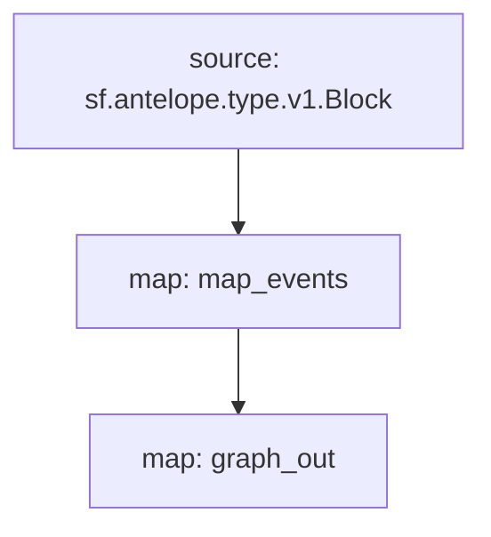

# `AtomicAssets` powered by **Substreams**

[](https://github.com/pinax-network/substreams-atomicassets/actions/workflows/test.yml)


> AtomicAssets Tables operations & transfers

## Quick Start

```
gh repo clone pinax-network/substreams-atomicassets
cd substreams-atomicassets
make
make run        # runs the map_events module for a block
```

### Mermaid graph


## Map Outputs

### `graph_out`

```json
{
  "entityChanges": [
      {
        "entity": "Assets",
        "id": "2199025347211",
        "operation": "OPERATION_CREATE",
        "fields": [
          {
            "name": "asset_id",
            "newValue": {
              "bigint": "2199025347211"
            }
          },
          {
            "name": "template_id",
            "newValue": {
              "int32": "9233"
            }
          },
          {
            "name": "scope",
            "newValue": {
              "string": "womplayitems"
            }
          },
          {
            "name": "collection_name",
            "newValue": {
              "string": "uplandislive"
            }
          }
        ]
      }
  ]
}
  
```

### Modules
```yaml
Package name: atomicassets
Version: v0.2.0
Doc: Substreams for AtomicAssets Tables
Modules:
----
Name: map_events
Initial block: 0
Kind: map
Output Type: proto:antelope.atomicassets.v1.AnyEvents
Hash: a7a4914fea37d5766fae4a8c34744ce6defc4f0a

Name: graph_out
Initial block: 0
Kind: map
Output Type: proto:sf.substreams.sink.entity.v1.EntityChanges
Hash: bc20455f1f9f3192d1ee64178af90cd33b5ff5cf
```