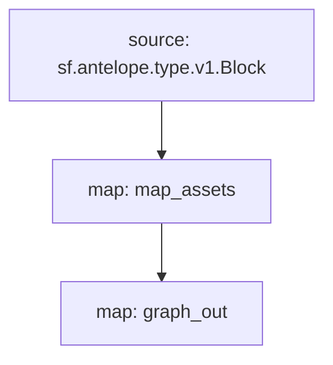

# AtomicAssets Assets Table powered by **Substreams**

[](https://github.com/pinax-network/substreams-atomicassets/actions/workflows/test.yml)


> Asset ID, Template ID, Scope & Collection name

## Quick Start

```
gh repo clone pinax-network/substreams-atomicassets
cd substreams-atomicassets
make
make run        # runs the map_assets module for a block
```

### Mermaid graph


## Map Outputs

### `graph_out`

```json
{
  "entityChanges": [
      {
        "entity": "Assets",
        "id": "2199025347211",
        "operation": "OPERATION_CREATE",
        "fields": [
          {
            "name": "asset_id",
            "newValue": {
              "bigint": "2199025347211"
            }
          },
          {
            "name": "template_id",
            "newValue": {
              "int32": 9233
            }
          },
          {
            "name": "scope",
            "newValue": {
              "string": "womplayitems"
            }
          },
          {
            "name": "collection_name",
            "newValue": {
              "string": "uplandislive"
            }
          }
        ]
      }
  ]
}
  
```

### Modules
```yaml
Package name: atomicassets
Version: v0.0.1
Modules:
----
Name: map_assets
Initial block: 0
Kind: map
Output Type: proto:antelope.atomicassets.v1.AssetsTableOperations
Hash: a10068218183fba448c923f3b72548fd1ab1ec91

Name: graph_out
Initial block: 0
Kind: map
Output Type: proto:sf.substreams.sink.entity.v1.EntityChanges
Hash: 707e9ad41e6a95e254bc924f64a6482a977db197
```