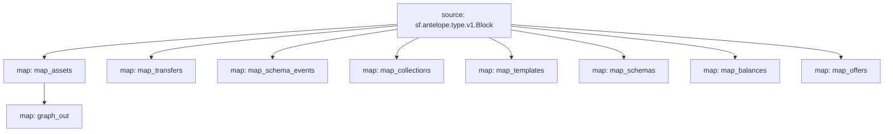

# `AtomicAssets` powered by **Substreams**

[](https://github.com/pinax-network/substreams-atomicassets/actions/workflows/test.yml)


> Asset ID, Template ID, Scope & Collection name

## Quick Start

```
gh repo clone pinax-network/substreams-atomicassets
cd substreams-atomicassets
make
make run        # runs the map_assets module for a block
```

### Mermaid graph


## Map Outputs

### `graph_out`

```json
{
  "entityChanges": [
      {
        "entity": "Assets",
        "id": "2199025347211",
        "operation": "OPERATION_CREATE",
        "fields": [
          {
            "name": "asset_id",
            "newValue": {
              "bigint": "2199025347211"
            }
          },
          {
            "name": "template_id",
            "newValue": {
              "int32": "9233"
            }
          },
          {
            "name": "scope",
            "newValue": {
              "string": "womplayitems"
            }
          },
          {
            "name": "collection_name",
            "newValue": {
              "string": "uplandislive"
            }
          }
        ]
      }
  ]
}
  
```

### Modules
```yaml
Package name: atomicassets
Version: v0.1.0-dev
Doc: Substreams on AtomicAssets standard
Modules:
----
Name: map_assets
Initial block: 0
Kind: map
Output Type: proto:antelope.atomicassets.v1.AssetsTableOperations
Hash: 7ab5cbcb14965d2654c1a6de73e476a558f62b12

Name: graph_out
Initial block: 0
Kind: map
Output Type: proto:sf.substreams.sink.entity.v1.EntityChanges
Hash: 6133be0c61996ba3e78438388432fb2b7d736579

Name: map_transfers
Initial block: 0
Kind: map
Output Type: proto:antelope.atomicassets.v1.TransferEvents
Hash: bec890a245959119bb5c556d11382debf709b1a2

Name: map_schema_events
Initial block: 0
Kind: map
Output Type: proto:antelope.atomicassets.v1.SchemaEvents
Hash: 670fccc558dcc392beb0959327df1f84421b57eb

Name: map_collections
Initial block: 0
Kind: map
Output Type: proto:antelope.atomicassets.v1.Collections
Hash: aa9d13fb60eb733ff5e0a157b4a7b663528844df

Name: map_templates
Initial block: 0
Kind: map
Output Type: proto:antelope.atomicassets.v1.Templates
Hash: 2a6cbc77cedbbbb175a12c072fd19be48a2f84c7

Name: map_schemas
Initial block: 0
Kind: map
Output Type: proto:antelope.atomicassets.v1.Schemas
Hash: 25a00eecae44650341eab9152fffd9a6b7490893

Name: map_balances
Initial block: 0
Kind: map
Output Type: proto:antelope.atomicassets.v1.Balances
Hash: f9d7be39355e1d667482a3c24cf4d6bfaa373649

Name: map_offers
Initial block: 0
Kind: map
Output Type: proto:antelope.atomicassets.v1.Offers
Hash: 01614dc7897c67568b25dca861fb625b0c0d352f
```